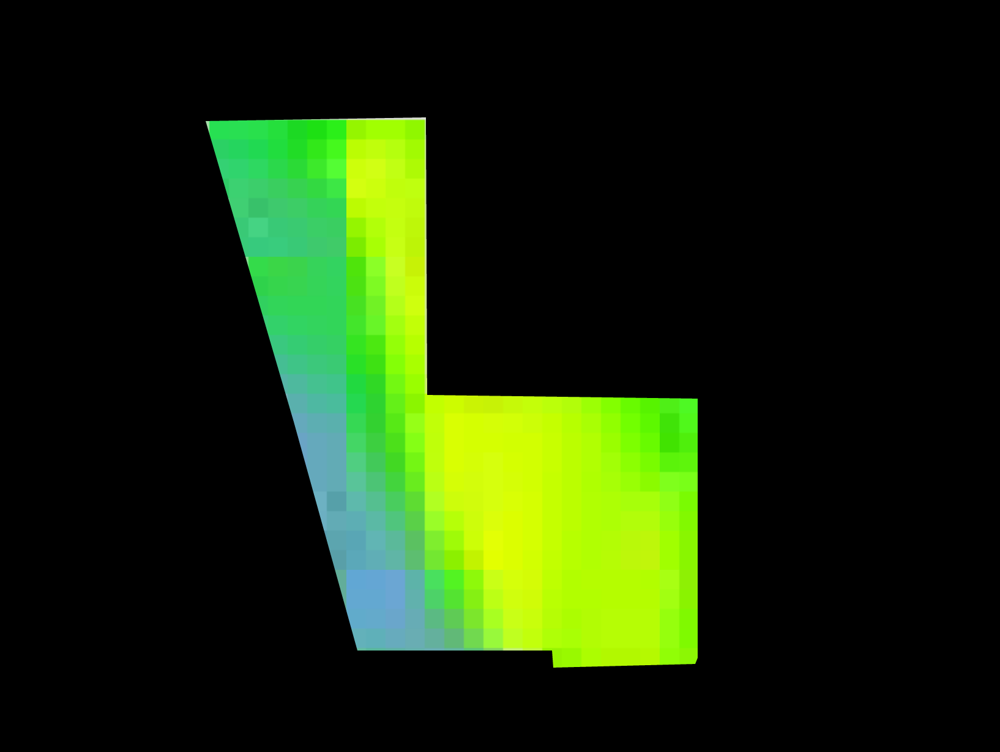

# Masking Astro Digital NDVI Data In A Map

### [Working Example](https://rawgit.com/AstroDigital/example-field-mask/master/example/index.html) | [Primary Code](https://github.com/AstroDigital/example-field-mask/blob/master/example/ad-masked-map.js)

[](https://rawgit.com/AstroDigital/example-field-mask/master/example/index.html)

## Overview
This tutorial describes using Astro Digital raster and vector data to mask and bring focus to individual features in the raster product within a Leaflet map. Be sure to check out the [Basic Astro Digital NDVI vector map setup](https://github.com/AstroDigital/example-ndvi-vector) tutorial, which describes the basics of map initialization in more detail. Other topics in this series include:
- [Symbolizing the NDVI vector product map](https://github.com/AstroDigital/example-ndvi-vector-symbology) and
- [Graphing the NDVI values using Chart.js, and including precipitation as a secondary datasource](https://github.com/AstroDigital/example-ndvi-chart-plus).

## Summary

A feature mask can be created from the NDVI values geometry described in the [basic tutorial](https://github.com/AstroDigital/example-ndvi-vector) by developing a multi-polygon where the outer ring is a rectangle representing the full area of the world, and the inner ring (hole) is the geometry of each feature.

Begin by mapping over the `results` attribute of the [Astro Digital's NDVI values API response](https://docs.astrodigital.com/docs/results) data to create an array of GeoJSON where the geometry of each feature is a composite array consisting of a -180/-90 to 180/90 coordinate array and the original features's coordinate array. The result will be a polygon covering the entire surface of the world, with a tiny hole cut out of it in the shape of the input feature:
```js
let fieldsJson = adNdviData.results.map((field) => {
  const id = field.id;
  field = field.value;
  // Save the original feature boundaries as a property, so that they can
  // later be used to focus on the feature.
  field.properties.bounds = L.geoJson(field).getBounds();
  field.properties.id = id;
  // Assemble the mask from a coordinate array representing the world's area
  // combined with each feature's native geometry.
  field.geometry.coordinates = [
    [
      [-180, -90],
      [-180, 90],
      [180, 90],
      [180, -90],
      [-180, -90]
    ],
    field.geometry.coordinates[0]
  ]
  return field;
})
```

After creating a basemap, for this demo we will wrap the masking function calls in a loop to cycle through each feature, as shown below:
```js
// Cycle through features, sending one at a time to the focusOnFeature function.
let displayIndex = 0;
setInterval(() => {
  // Remove previous mask, if applicable.
  map.eachLayer((lyr) => {if (!lyr._tiles) map.removeLayer(lyr)})
  // Focus on feature.
  focusOnFeature(fieldsJson[displayIndex])
  // Increment loop, or repeat from beginning if all features have been cycled through.
  displayIndex = (displayIndex < fieldsJson.length - 1) ? displayIndex + 1 : 0;
}, 1500);
```
The focusOnFeature function being called from this loop converts one GeoJSON feature at a time to a Leaflet polygon object, which is is symbolized as opaque black (recall that the feature is an Earth-sized rectangle with the feature as its inner ring). It then adds this feature to the map and zooms to its extent, giving it focus while masking all other pixels in the raster from view.
```js
const focusOnFeature = (fieldJson) => {
  L.geoJson(fieldJson, {
      fillOpacity: 1,
      fillColor: '#000',
      weight: 0
    }).addTo(map);
  map.fitBounds(fieldJson.properties.bounds);
}
```

Check out [the source code for more details!](example/ad-masked-map.js)
